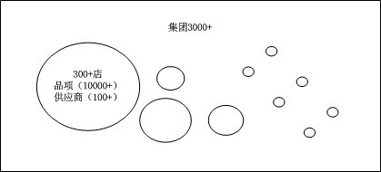
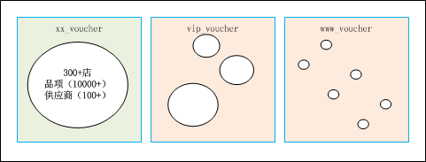
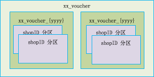

# 在线系统大数据解决方案
## 背景
在线系统：
    服务于餐饮企业用于品项（食材）库存管理。

基本数据情况：
1. 目前集团数有3000+，其中含有KA集团 10+
2. 集团全国有300+店而且品项（10000+）供应商（100+），每天的会产生大量的订单（单据）
3. 然后就会涉及到多种单据类型（20种+ 例如：入库单，出库单，直发单，直配单，报损单，盘点出库单）
4. 每个月在200w条，每条记录的字段数（110+），每条记录大小（1K+），建立的索引个数（20+），每个存数据量在1GB+

 名词解释：
 1. 品项： 食材分类，对应sku
 2. 餐饮企业（集团）:有3种类型，强连锁、弱连锁（加盟）、单店，个别连锁店有自己的配送中心
 3. KA集团： 是指核心大用户，门店数在100家以上
 
 ## 当前数据问题
 从上线到使用已经有1年的时间，在数据库中积累了大量的数据，导致数据读取速度非常慢；
 
 ## 问题分析
 1. 分析业务情况
    各个集团的使用都是独立的，可以单独进行管理因此可以针对KA集团和普通集团进行“分而治之”，从集团维度进行垂直分库；
    通过分析可以根据groupd进行分库管理，针对数据冷热度进行存储隔离
 
 
 
 2. 数据使用分析
    数据生成：针对单个集团有点门店数超过300+，每年能够到达2000w条记录以上，以线性递增的方式进行累积；
    数据读取：基本使用的热数据最近3天，温数据最近60天，冷数据1年，冰数据3年，基本3年以前的数据都不用了；
 
 针对单表过大的问题采用分表按年（yyyy）和分区（shopID）处理
 
 
 
 3. 用户活跃分析
    核心大集团基本每月都有大量的订单，普通集团每周有300+近1/10的更替，变成死数据（可以直接冻结然后清理掉）
 
## 解决方案
### 1. 系统调整
1.1 针对分库可以通过Zk的方式，将groupID-uri:mysql进行绑定，直接路由查询，集成JAR可以完成；
1.2 针对分表可以通过时间进行分表，按照写入的时候时间，写入的逻辑可以采用yyyy进行， 需要修改代码增加后缀；
        读取的时候就比较麻烦，仅仅读取就必须带时间参数即下单的时间，根据时间进行查询；如果跨年查询就需要多个表进行拼接了。
        注意：如果采用时间分表，就需要针对时间的参数可以传入。
        
### 2. 难点
2.1 针对分库可以对用户透明的方式进行；针对分表就需要涉及到业务代码的修改了，采用分区可以避免代码的修改；
2.2 针对需要分表的实体，可以提供原子操作服务，从当前系统中抽取对应mysql操作。
2.3 另外涉及到表的同步问题，即将制定的表同步 canal可以订阅数据库所有的表，将数据以增量的形式同步到指定的ES中；
    
## 代码重构
需要针对性voucher和voucher_detail进行重构，采用groupID分库后，就仅仅针对voucher_detail进行时间分表。（注：这里的时间是写入时间）
至于根据shopID进行分区对业务是透明的。

### voucherDate时间分表
1. 原有的接口需要兼容，采用默认时间2017或者2018或者查询和删除的时候都进行处理；（可以仅仅是2018）
2. 原有的数据进行分开： 
    2.1 需要新建分表
    2.2 将数据导入到分表 
    （并启动同步最近修改数据，根据actionTime分段读取数据，然后将结果根据voucherDate写入/更新到表）
    2.3 停止服务
    2.4 更新服务
3. 数据ES同步问题： 每增加一个表都需要调整同步配置，可以针对时间表进行特殊的分割 例如:voucher_detail#2018， 为了更好的使用open和close，所以保持index和type是一致的
4. 后续维护问题： 如果增加字段，所有按时间划分的表都需要增加

### 代码修改
1. 需要voucher以及voucher_detail的操作Command和Query进行ChainVoucherDetailMapper添加ChainVoucherDetailExMapper进行封装
2. 添加时候，需要同系统生成voucherDate，并获取yyyy然后写入到表
3. 修改或删除的时候需要提供ID和voucherDate
4. 查询时候，需要查询范围时间yyyy， 默认2018

