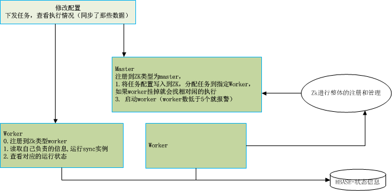

# mysql2es 数据从mysql导入到es

## 背景
主要通过针对mysql的表导入es中index.type中，es可以采用默认的mapping设置. 

## 设计方案

* PS：如果线程数发生修改，启动重启后会取最小更新的时间
* 数据写入采用，直接PUT（存在就更新，不存在就插入）

### 第1步 批量高并发导入 
  根据createTime进行并发insert,并记录最大的insertDs， where createTime>insertDs；
  
### 第2步 实时增量同步
* 根据actionTime进行同步最新需要记录where actionTime>lastDs 

* 在并行下可能会涉及到对应的乱序问题，所以需要针对Thread进行Hash队列化处理，即同样的ID总由一个固定的线程处理

## 编码实现
可以采用java进行实现，方便做成服务，将任务进行配置化管理。（shell、python、php 都有点小儿科）
可以有2种使用模式
1.直接运行导入数据，进行后台运行，可以手工结束。


2.以服务的方式运行，采用服务平台的方式，通过命令行或者api接口进行添加同步项。



## 分表的数据同步
可以采用shell脚本，采用时间点切片ds1-ds2，进行
``` sql
insert into dstTable(field1,field2,...) 
select v1,v2,... 
from srcTable 
where activeTime>=ds and activeTime<ds2
  and createTime>=20180000 and createTime<20190000
```

## 对比canal VS 从库扫描
### 1. canal优点和不足
#### 优点
1. 增量，对数据库性能几乎没有任何压力；
2. 同步实时性非常高；
#### 不足
1. 仅仅增量，无法补数据和全量数据；
2. 跟业务的融合度比较高，即业务需要同步那些表都需要进一步的配置；
### 2. 从库扫描
#### 优点
1. 根据指定的时间点（业务更新时间点），进行切片同步， 仅仅读取从库，对从库稍微有压力；
2. 方便业务配置，从统一界面可以很方便配置：源（mysqlUri srcTable以及对应字段）和目的（uri，table，映射字段）以及同步的频次等；
3. 对比阿里数据同步一样的东西，使用比较统一而且方便；
#### 不足
1. 实时性稍弱，频次一般设置为1s或者30s或者60s或者15m或者1h等
2. 对从库稍有压力，增加额外的范围量

